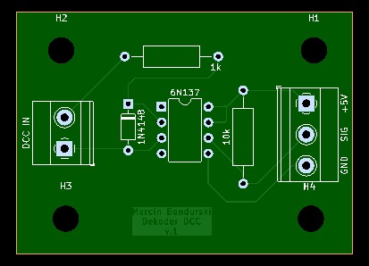

# DCC Turnout Servo Decoder

Arduino-based DCC accessory decoder that drives model railway turnouts with standard hobby servos.
The command station sends a turnout command, the Arduino decodes it and slowly moves the servo for a realistic throw.

## Features

- Works with any DCC command station that sends basic accessory commands
- Each servo has its own DCC address, "closed" angle and "thrown" angle
- Slow, adjustable servo movement
- Track signal isolated from the Arduino with a 6N137 optocoupler
- Easy to extend to more servos
- Serial Monitor debug output showing every received address

## Hardware

| Part | Qty | Notes |
|------|-----|-------|
| Arduino Uno / Nano | 1 | Any ATmega328P board |
| 6N137 optocoupler | 1 | Isolates the DCC track signal |
| 1N4148 diode | 1 | Protects the optocoupler LED from reverse voltage |
| Resistor 1 kΩ | 1 | Current limit for the optocoupler LED (or 2 × 2.2 kΩ in parallel if it gets hot) |
| Resistor 10 kΩ | 1 | Pull-up on the optocoupler output |
| Hobby servo (e.g. SG90) | 2+ | One per turnout |

### DCC input circuit


The DCC track signal drives the LED inside the 6N137 through the 1 kΩ resistor. The 1N4148 diode protects the LED during the negative half of the DCC signal. On the output side, the 10 kΩ pull-up gives a clean 5 V logic signal on **Arduino pin 2**.

### PCB



Gerber files for ordering the board: [`docs/train_servo-pcb-v3_gerbers.zip`](docs/train_servo-pcb-v3_gerbers.zip)

### Wiring

| Connection | Arduino pin |
|------------|-------------|
| 6N137 output (pin 6) | D2 |
| Servo 0 signal | D9 |
| Servo 1 signal | D10 |
| Servo + / 6N137 pin 8 | 5V |
| Servo − / 6N137 pin 5 | GND |

## Software

### Libraries

- [DCC_Decoder](https://github.com/MynaBay/DCC_Decoder) by MynaBay: download the ZIP and add it via **Sketch → Include Library → Add .ZIP Library**
- Servo: included with the Arduino IDE

### Configuration

At the top of `dcc-turnout-servo-decoder.ino`:

```cpp
#define NUMSERVOS   2   // number of servos
#define SERVOSPEED 30   // ms per 1° step, lower = faster
```

In `setup()`, one block per servo:

```cpp
servo[0].address   =   7 ;  // DCC address
servo[0].servo.attach( 9);  // servo signal pin
servo[0].offangle  = 110 ;  // angle when closed
servo[0].onangle   =  75 ;  // angle when thrown
```

To add a servo, copy a block, increase the index (`servo[2]` …) and increase `NUMSERVOS`.

### Roco Multimaus / Z21

These command stations number accessory addresses with an offset of 4. If your turnouts react to the wrong address, uncomment this line in `BasicAccDecoderPacket_Handler()`:

```cpp
// address = address - 4
```

## Setting the servo angles

1. Open the Serial Monitor at 9600 baud.
2. Switch a turnout on your command station. The received address and state are printed.
3. Adjust `offangle` and `onangle` until the servo just reaches the end of the turnout throw. Pushing past that point makes the servo strain and buzz.

## How it works

1. `DCC.loop()` reads the DCC signal on pin 2.
2. On every accessory packet, `BasicAccDecoderPacket_Handler()` calculates the accessory address and stores the requested state for the matching servo.
3. `loop()` sets each servo's target angle and moves it 1° every `SERVOSPEED` ms until it reaches the target.

## License

MIT
